# Spatial Verification of a Coordinate Measuring Machine

<p align="center">
  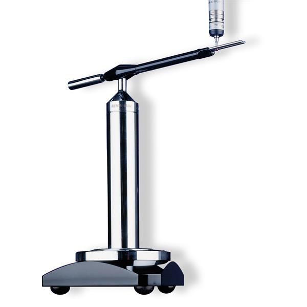
</p>

<p align="center">
  <em>Renishaw Machine Checking Gauge trajectory design &middot; geometric-error identification &middot; hysteresis assessment &middot; extended workspace coverage</em>
</p>

<p align="center">
  <a href="#"></a>
  <a href="#"></a>
  <a href="#"></a>
  <a href="#"></a>
  <a href="#"></a>
  <a href="#"></a>
</p>

<p align="center">
  <a href="docs/Spatial_Verification_of_a_CMM_Report.pdf"></a>
</p>

## Overview

This project develops a metrologically rigorous workflow for periodic verification of a Cartesian **coordinate measuring machine (CMM)** using a **Renishaw Machine Checking Gauge (MCG)** — a large-radius kinematic artefact whose arm sweeps a circle (planar campaign) or a spherical segment (spatial campaign) about a fixed mechanical center. Carried out at **Arts et Métiers ParisTech (ENSAM), Lille**, the work combines:

1. **Trajectory generation** in Python — nominal points and unit probing normals for circular and spherical paths, at six available MCG arm lengths (101 – 685 mm).
2. **CMM execution** on a ZEISS machine (CALYPSO), with unidirectional and reversal-containing scan sequences designed to expose direction-dependent behaviour.
3. **Planar circularity analysis** across four traversal strategies.
4. **Spatial error identification** — a linear least-squares model that jointly estimates sphere-center offset, effective radius error, and small axis-squareness terms from the scalar normal deviations returned by the CMM.
5. **A MATLAB correction and validation pipeline** — robust (Huber-weighted) parameter estimation, systematic-error correction along the probing normals, and before/after form-error metrics, with an explicit forward/reverse split for hysteresis diagnostics.
6. **A revised verification protocol**: equal-area spherical sampling, unidirectional reference paths, paired reversal tests, and an explicit uncertainty budget aligned with **ISO 10360** and the **GUM** framework.

The full write-up — including the complete metrological framework, uncertainty budget, and the four-phase verification protocol — is in [`docs/Spatial_Verification_of_a_CMM_Report.pdf`](docs/Spatial_Verification_of_a_CMM_Report.pdf) (Research Edition). This README summarizes the method, reproduces every governing equation directly (no report screenshots), and documents how the code is meant to be reused.

> **Team project**: Dev Kumar, Thien Ho, supervised by Thierry Coorevits (ENSAM Lille, Semester 8).

## Key reported results

| Item | Result |
|---|---|
| Planar circularity range | 1.10 – 1.49 µm (mean 1.27 µm) |
| Unidirectional paths, average circularity | 1.115 µm |
| Reversal-containing paths, average circularity | 1.43 µm |
| Unidirectional vs. reversal difference | ≈ 22 % lower without reversal |
| MCG arm length used for the planar campaign | 151 mm |
| Points per planar revolution / latitude rings | 60 / 10 rings over ±45° |
| Spherical-band coverage (±45°) | 70.7 % of full sphere area |
| Spatial fit — translation & radius channels | Recovered to the reported precision in the synthetic validation |
| Spatial fit — original angular channels (α, β) | Order-of-magnitude scale mismatch (≈99× and ≈9.9×) — flagged as unvalidated, see below |

## Method

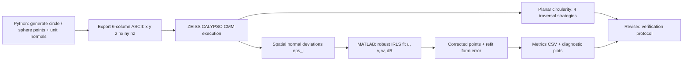

### 1. Normal-direction measurement model

Every point the CMM returns is a scalar deviation `ε_i` along a commanded probing normal `n_i`, applied to a nominal point `p_i`. The reconstructed measured point is:

$$
\mathbf{q}_i = \mathbf{p}_i + \varepsilon_i\, \mathbf{n}_i , \qquad \lVert \mathbf{n}_i \rVert_2 = 1
$$

This is the single link between the theoretical trajectory and the experimental data, and the reason a scalar normal residual alone cannot separate tangential error components unless the path geometry varies enough over the campaign.

### 2. Parametric circle and sphere generation

For a circle of radius `R` centered at `c = (c_x, c_y, c_z)`, in the XY plane:

$$
\mathbf{p}(\theta) = \mathbf{c} + R\begin{bmatrix}\cos\theta \\ \sin\theta \\ 0\end{bmatrix}, \qquad
\mathbf{n}(\theta) = \begin{bmatrix}\cos\theta \\ \sin\theta \\ 0\end{bmatrix}, \qquad
\theta_i = \theta_0 + \frac{2\pi i}{N}
$$

For a spherical trajectory over azimuth `θ` and elevation `φ`:

$$
\mathbf{p}(\phi,\theta) = \mathbf{c} + R\begin{bmatrix}\cos\phi\cos\theta \\ \cos\phi\sin\theta \\ \sin\phi\end{bmatrix}, \qquad
\mathbf{n}(\phi,\theta) = \frac{\mathbf{p}(\phi,\theta) - \mathbf{c}}{R}
$$

The reported campaign restricts elevation to `-45° ≤ φ ≤ 45°`, giving a ring radius `ρ(φ) = R cos φ` and ten latitude rings:

$$
\phi_j = -45^\circ + j\,\frac{90^\circ}{M-1}, \qquad M = 10
$$

**Probe-retention (chord) criterion.** Because the CMM travels in a straight chord rather than the circular arc between two stations `Δθ = 2π/N` apart, the commanded travel is `d_c = 2R sin(Δθ/2)`. If `d_max` is the largest displacement that keeps the stylus captured by the MCG fork:

$$
N \;\ge\; \left\lceil \frac{\pi}{\arcsin\!\left(d_{\max}/2R\right)} \right\rceil
$$

The original numerical study found `N_min = 30`; the campaign used `N = 60` for a conservative margin (chord length ≈ 15.81 mm at R = 151 mm).

### 3. Spatial error identification (7-parameter model)

For an ideal sphere, the realized geometry is modeled as a translated center `t = (u, v, w)`, an effective radius `R + δR`, and three small axis-squareness terms `(α, β, γ)`. To first order:

$$
\varepsilon_i \approx u\,n_{x,i} + v\,n_{y,i} + w\,n_{z,i} + \delta R - \alpha z_i n_{y,i} - \beta x_i n_{z,i} - \gamma y_i n_{x,i} + \eta_i
$$

Written as a linear system `ε = A q + η` with `q = [u, v, w, δR, α, β, γ]ᵀ`, the least-squares estimate is the Moore–Penrose solution:

$$
\hat{\mathbf q} = A^{+}\varepsilon, \qquad \hat\sigma^2 = \frac{\lVert \hat{\mathbf r} \rVert_2^2}{N-p}, \qquad \operatorname{Cov}(\hat{\mathbf q}) \approx \hat\sigma^2 (A^{\mathsf T} A)^{-1}
$$

`python/spatial_identification/spatial_error_model.py` solves this with column-scaled QR/SVD (never forming `AᵀA` explicitly) and reports the condition number `κ(A)` alongside the fit — a large value flags parameter combinations that are nearly indistinguishable from the residual field alone.

### Audit finding — treat α, β as unvalidated

The original project solved the three squareness angles as **three separate, sequential single-parameter systems** instead of the joint 7-parameter model above. Validating that approach against a known synthetic parameter vector reproduced translation, radius, and `γ` almost exactly, but returned `α` and `β` roughly **99× and 9.9× too large**. This is too large to be floating-point rounding and points to a unit conversion, sign-convention mismatch, or parameter coupling in the original three-system approach — the joint SVD solution in this repository resolves it, and its own synthetic self-test (`_demo()` in `spatial_error_model.py`) recovers all seven parameters to machine precision.

**Practical rule:** don't upload `α`/`β` from the original per-axis fits as compensation values. Refit jointly, check `κ(A)`, and re-run the synthetic self-test before trusting any angular channel.

## MATLAB correction & validation pipeline (`matlab/Metrology_Correction.m`)

This is the piece that turns an identified error model into an actual **corrected point file plus a metrics report**, and it is the tool a metrologist runs directly on ZEISS export files. What it does, in order:

1. **Loads and validates** the theoretical file and one or two experimental files (`X Y Z NX NY NZ`, tab/whitespace separated); rejects mismatched point counts and non-unit normals.
2. **Classifies the geometry** (circle vs. sphere) from the singular values of the centered point cloud.
3. **Computes normal-direction deviations** `ε_i = (P_exp - P_theory)_i · n_i` for the forward run and, if supplied, the reverse run.
4. **Separates systematic bias from hysteresis** when both directions are available:

   $$
   \varepsilon_{\text{ident}} = \tfrac{1}{2}(\varepsilon_{\text{fwd}} + \varepsilon_{\text{rev}}), \qquad
   h = \tfrac{1}{2}(\varepsilon_{\text{fwd}} - \varepsilon_{\text{rev}})
   $$

5. **Fits the 4-parameter model** `ε_i ≈ n_i·[dX dY dZ] + dR` by **iteratively reweighted least squares with Huber weights**:

   $$
   w_i = \begin{cases} 1, & |u_i| \le c \\ c/|u_i|, & |u_i| > c \end{cases}, \qquad c = 1.345, \qquad u_i = r_i/\hat\sigma
   $$

   so a handful of isolated probing anomalies don't drag the whole fit.
6. **Corrects only the identified systematic component** along the theoretical normals (`P_corrected = P_exp − (A·β)·n`), then **refits** the circle/sphere on the corrected cloud and **rebuilds normals from the corrected geometry** — it does not filter normal components independently, which would break the geometric consistency of the model.
7. **Reports metrics before/after correction**: mean, RMS, peak-to-valley, standard deviation, a repeatability-based expanded uncertainty (k = 2), form error, and fit RMS residual — plus bidirectional hysteresis RMS/max if a reverse file was supplied.
8. **Writes outputs** to `outputDirectory`: corrected point files, `*_metrics.csv`, `*_identified_parameters.csv`, and (if `generateFigures` is true) diagnostic PNGs of normal residuals, form residuals, and — when available — the forward/reverse comparison and hysteresis trace.

### Using it on your own data

```matlab
cfg = struct;
cfg.theoreticalFile = 'coordonnees_theorique.txt';   % nominal x y z nx ny nz
cfg.forwardFile     = 'experimentale.txt';           % same point order, measured
cfg.reverseFile     = 'experimentale_retour.txt';    % optional, for hysteresis
cfg.outputDirectory = 'metrology_output';
cfg.units           = 'mm';                          % label only, doesn't rescale
cfg.huberK          = 1.345;                         % Huber tuning constant
results = Metrology_Correction(cfg);
```

Requirements: **MATLAB R2019b+**, no toolboxes beyond base MATLAB. The theoretical and experimental files must list points in the *same order* — this is exactly the ordering guaranteed by the Python point-generation scripts and the ZEISS six-column export, so a file produced by `generate_planar_points.py` or `generate_spherical_points.py` and its corresponding CALYPSO deviation export are already compatible without reformatting.

**What this pipeline deliberately does *not* do:** it does not replace a moving-average smoothing pass with a "correction," it does not treat the 4-parameter fit as a volumetric compensation map, and it does not report a filtered circularity/sphericity value as the conformity result — see [Metrological scope](#metrological-scope) below.

## Repository structure

```
.
├── docs/
│   └── Spatial_Verification_of_a_CMM_Report.pdf     # full write-up (Research Edition)
├── python/
│   ├── point_generation/
│   │   ├── generate_planar_points.py                # circle + normals, 6 arm lengths, CW/CCW
│   │   └── generate_spherical_points.py              # 10-ring spherical segment, ±45°
│   └── spatial_identification/
│       ├── spatial_error_model.py                    # joint 7-parameter SVD fit (see audit note above)
│       └── smoothing_filter.py                       # diagnostic-only smoothing (Hampel + Savitzky-Golay)
├── matlab/
│   └── Metrology_Correction.m                        # robust correction + validation pipeline
├── data/
│   ├── planar_cw_60pts/                              # clockwise reference path, 6 arm lengths
│   └── planar_ccw_60pts/                             # counter-clockwise reference path, 6 arm lengths
└── assets/
    ├── mcg_artefact_photo.png
    └── figures/                                      # figures reproduced from the report (photos, sketches, plots)
```

Every point-set file is six whitespace-separated columns `x y z nx ny nz` (mm / unit vector), directly importable as a nominal-point program in ZEISS CALYPSO and directly consumable by `Metrology_Correction.m`.

## Tools and languages

| Domain | Tool |
|---|---|
| Trajectory generation, spatial model fitting | Python (NumPy, Matplotlib) |
| Point correction, robust fitting, metrics report | MATLAB (base, no toolboxes) |
| CMM execution & feature association | ZEISS CALYPSO |
| Verification artefact | Renishaw Machine Checking Gauge |
| Metrological framework | ISO 10360-2/5, ISO 1101, ISO 14253-1, JCGM 100 (GUM) |

## Selected figures

*(Reproduced directly from the report — photographs, hand sketches, and generated plots only; every equation above is native text/LaTeX, not a screenshot.)*

<table>
<tr>
<td>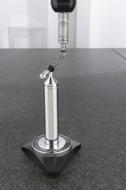<br><sub>Fig. 3.1(a) — MCG installed beneath the CMM probe</sub></td>
<td>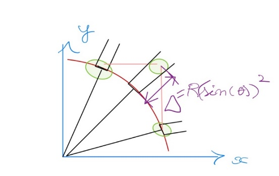<br><sub>Fig. 3.1(b) — straight-line probe motion between angular stations</sub></td>
<td>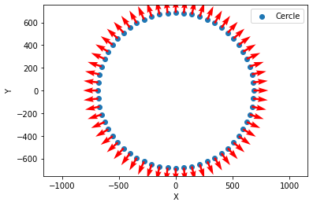<br><sub>Planar MCG trajectory, radial normals, probe-retention geometry</sub></td>
</tr>
<tr>
<td>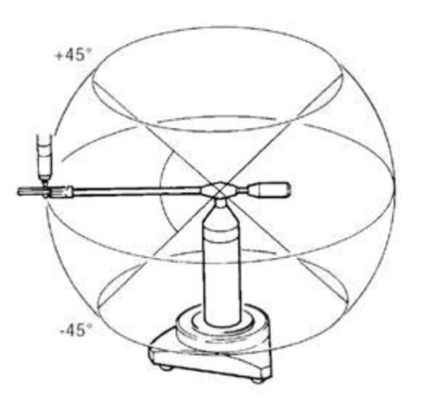<br><sub>Fig. 3.4 — MCG angular envelope, ±45° spherical segment</sub></td>
<td>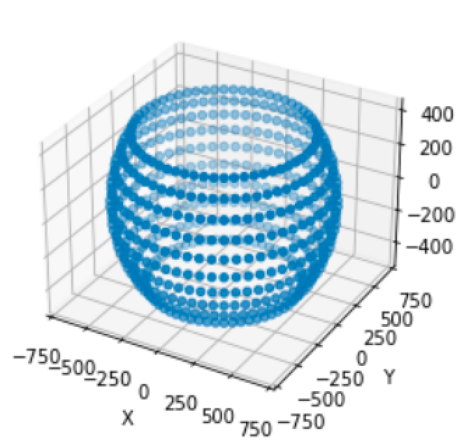<br><sub>Fig. 3.5(a) — nominal spatial sampling points</sub></td>
<td>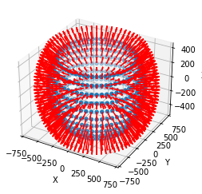<br><sub>Fig. 3.5(b) — associated radial probing normals</sub></td>
</tr>
<tr>
<td>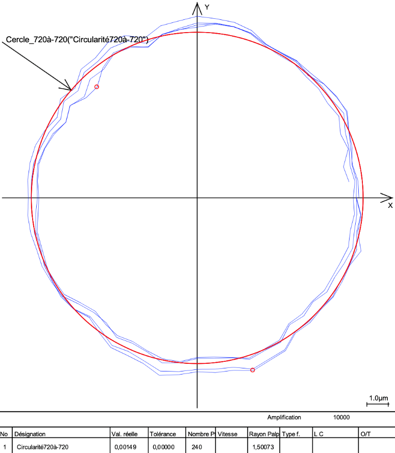<br><sub>Fig. 4.1(a) — circularity, −720°→+720°</sub></td>
<td>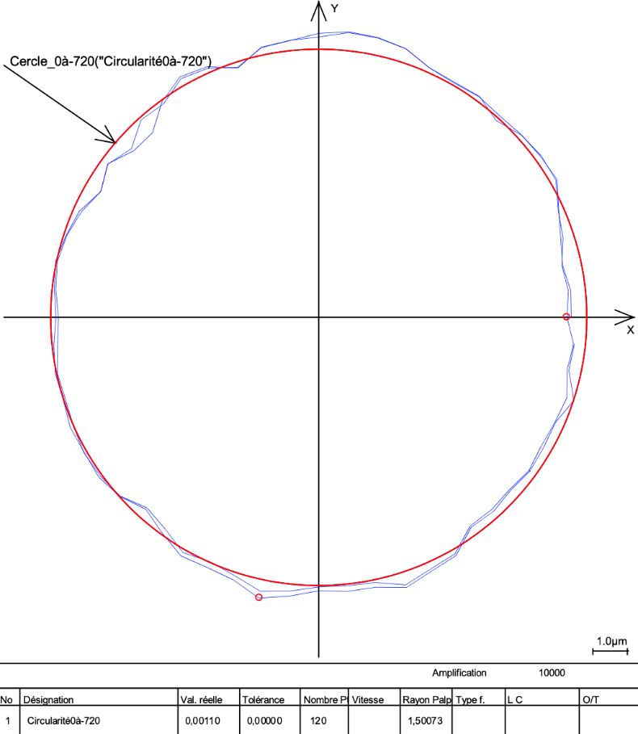<br><sub>Fig. 4.1(c) — circularity, 0°→−720° (unidirectional)</sub></td>
<td>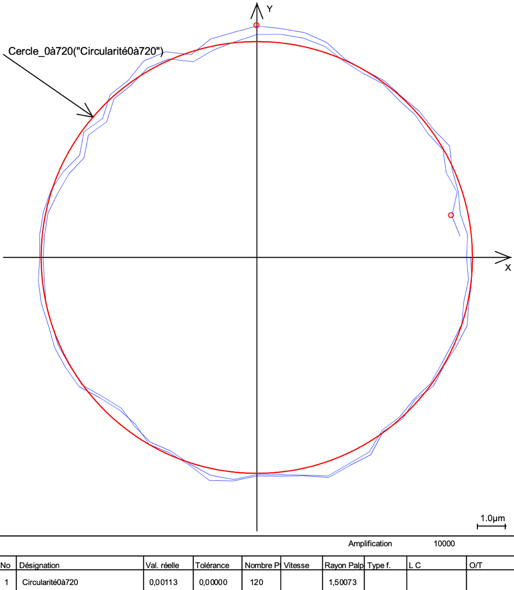<br><sub>Fig. 4.1(d) — circularity, 0°→+720° (unidirectional)</sub></td>
</tr>
<tr>
<td>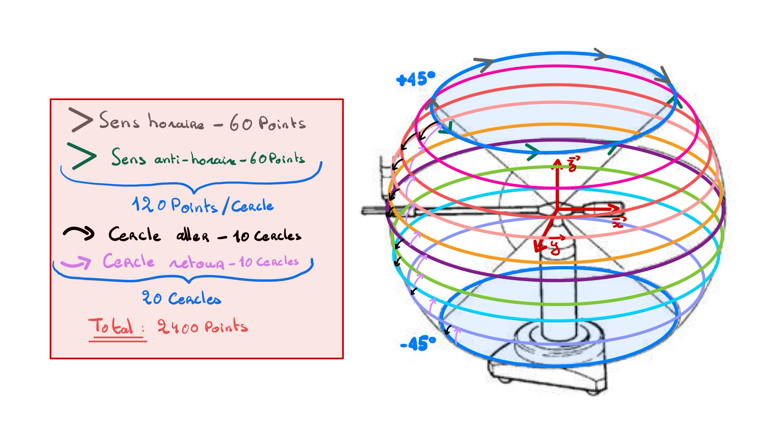<br><sub>Fig. 5.1 — consecutive latitude-circle sequences (original schematic)</sub></td>
<td>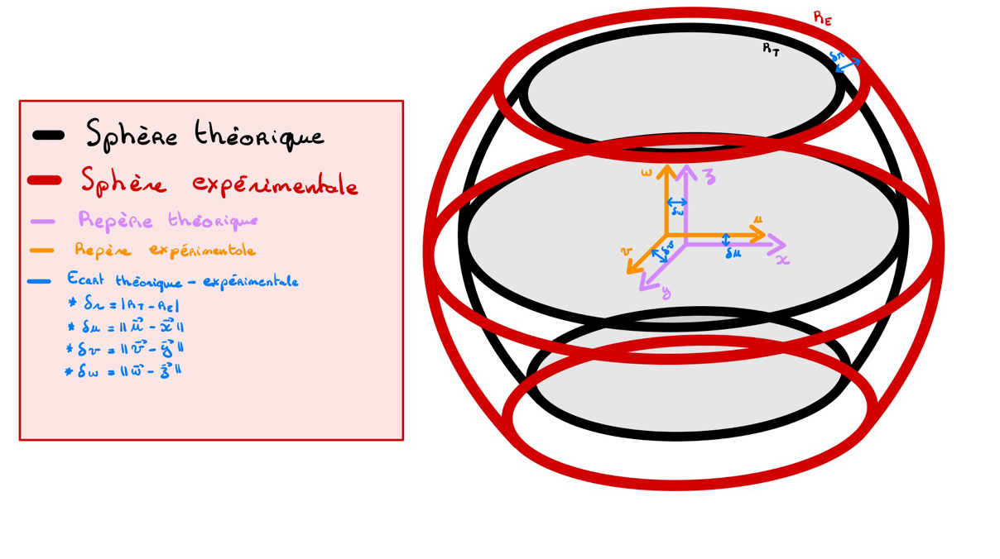<br><sub>Fig. 5.2 — ideal vs. translated, radius-offset sphere</sub></td>
<td>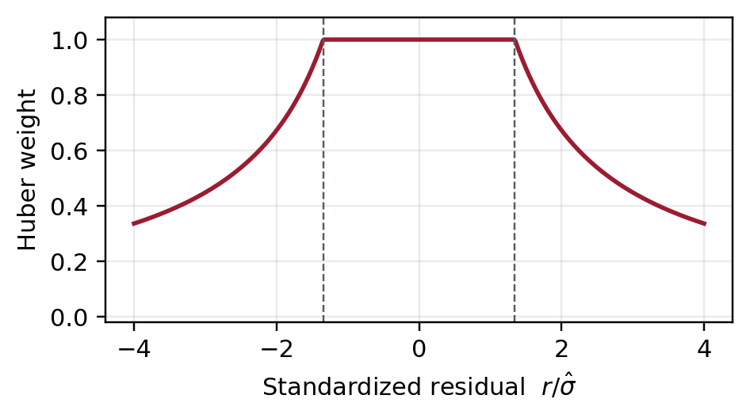<br><sub>Fig. 7 — Huber weights, iteratively reweighted solution</sub></td>
</tr>
<tr>
<td>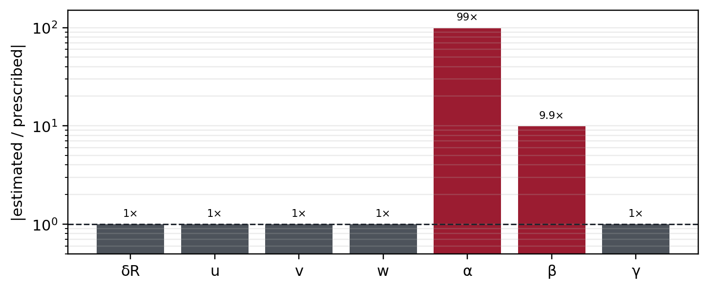<br><sub>Fig. 8 — synthetic parameter-recovery audit (α, β mismatch)</sub></td>
<td>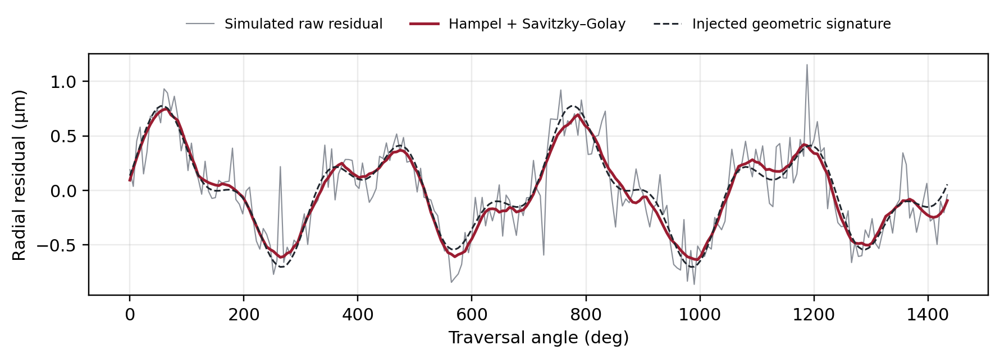<br><sub>Fig. 9 — simulated diagnostic filtering of a planar residual</sub></td>
<td></td>
</tr>
</table>

Figure 4.1(b) and the ±45° coverage diagram (Fig. 6.1) are omitted here as near-duplicates / vector-only content — both are in the full PDF.

## Running the scripts

```bash
# Generate the six-arm-length planar and spherical trajectories
python python/point_generation/generate_planar_points.py
python python/point_generation/generate_spherical_points.py

# Fit the spatial error model to a CMM deviation file
# (expects whitespace-separated columns: x y z nx ny nz eps)
python -c "
from python.spatial_identification.spatial_error_model import load_deviation_file, fit
xyz, normals, eps = load_deviation_file('your_deviation_file.txt')
result = fit(xyz, normals, eps, model='full')
print(result['x_hat'], result['condition_number'])
"

# Run the built-in synthetic validation (confirms the alpha/beta fix)
python python/spatial_identification/spatial_error_model.py
```

```matlab
% Correct and validate one CMM run (MATLAB)
cfg = struct('theoreticalFile', 'coordonnees_theorique.txt', ...
             'forwardFile',     'experimentale.txt', ...
             'reverseFile',     '', ...
             'outputDirectory', 'metrology_output');
results = Metrology_Correction(cfg);
```

## For another metrologist reusing this repository

1. **Generate (or reuse) a nominal trajectory** with `python/point_generation/` for your MCG arm length, point density, and elevation band. Verify the chord-length criterion above against your own MCG fork clearance (`d_max`).
2. **Export and run** the six-column file as a CALYPSO nominal-point program; execute at least one unidirectional run and, if you want a hysteresis estimate, one reversal run over the *same point order*.
3. **Feed both files into `Metrology_Correction.m`.** Read `*_metrics.csv` for the before/after form error and RMS, and `*_identified_parameters.csv` for the fitted `[dX dY dZ dR]`. Treat these four channels as usable; do **not** extend the pipeline's simple 4-parameter fit to squareness angles without switching to the joint 7-parameter Python model and rechecking `κ(A)`.
4. **Keep raw and corrected data separate.** The diagnostic filters (`smoothing_filter.py`, the Hampel + Savitzky-Golay stage described in the report) are for visualizing lobing/noise structure only — never substitute a filtered peak-to-valley value for the raw circularity/sphericity result in a conformity decision.
5. **Repeat before trending.** A single run per path family (as in the original campaign) cannot separate hysteresis from thermal drift, re-approach effects, or probing repeatability — the report's proposed protocol (chapter 6) calls for ≥5 repeats per direction, thermal logging, and an ABBA reversal schedule before any result is used as a control-limit input.

## Metrological scope

This is a diagnostic and verification study, not a complete ISO 10360 acceptance test. A low numerical form deviation is encouraging, but conformity requires a declared test procedure, calibrated artefacts, environmental records, decision rules, and a full uncertainty statement — see chapters 2 and 6 of the report for the complete discussion, the GUM-consistent uncertainty budget, and the proposed four-phase verification protocol (preparation, baseline planar campaign, spatial campaign, decision & trending).

## License

This project is released under the [MIT License](LICENSE).

## Contact

Dev Kumar &middot; [dev-kumar.com](https://dev-kumar.com) &middot; contact@dev-kumar.com
