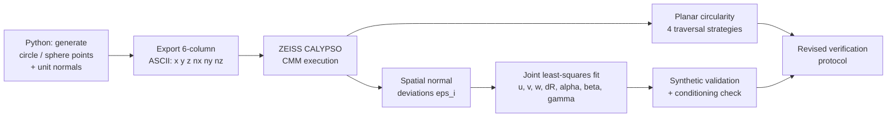
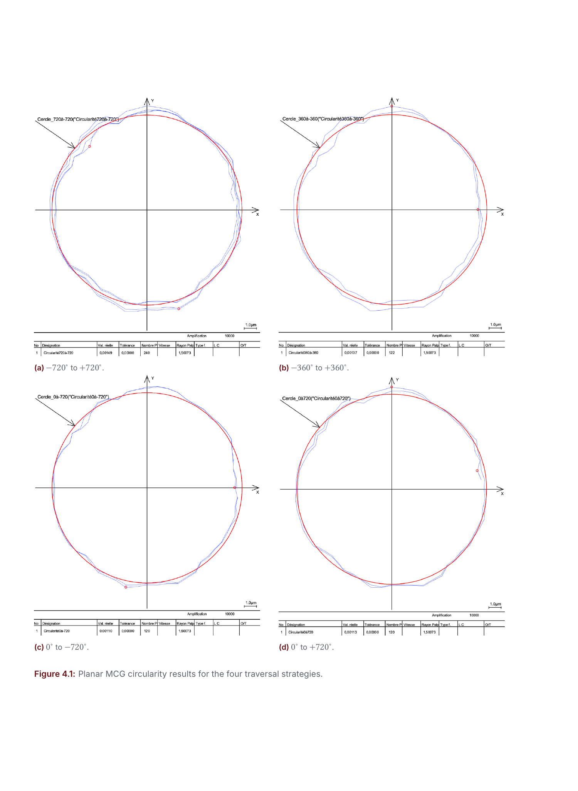
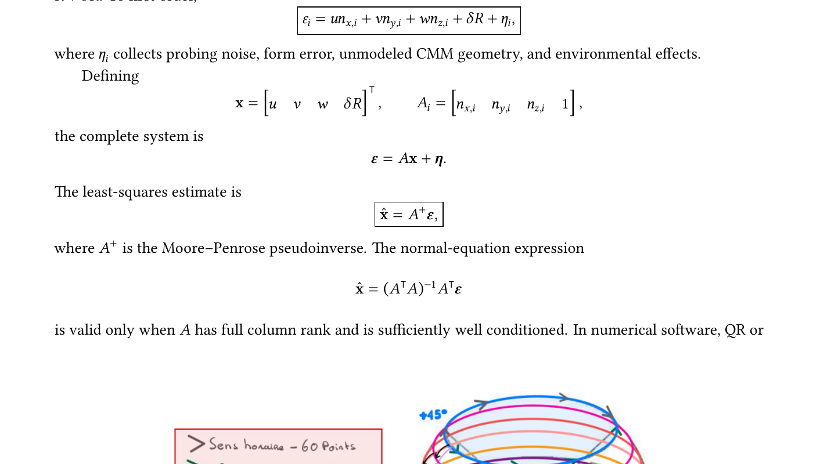

# Spatial Verification of a Coordinate Measuring Machine

<p align="center">
  
</p>

<p align="center">
  <em>Renishaw Machine Checking Gauge trajectory design &middot; geometric-error identification &middot; hysteresis assessment &middot; extended workspace coverage</em>
</p>

<p align="center">
  <a href="#"></a>
  <a href="#"></a>
  <a href="#"></a>
  <a href="#"></a>
  <a href="#"></a>
  <a href="#"></a>
</p>

<p align="center">
  <a href="docs/Spatial_Verification_of_a_CMM_Report.pdf"></a>
</p>

## Overview

This project develops a metrologically-grounded workflow for periodic verification of a **ZEISS coordinate measuring machine (CMM)** using a **Renishaw Machine Checking Gauge (MCG)** - a large-radius kinematic artefact whose arm sweeps a circle (or a spherical segment) about a fixed mechanical center. Carried out at **Arts et Metiers ParisTech (ENSAM), Lille**, the project combines:

1. **Trajectory generation** in Python - nominal points and unit probing normals for circular and spherical paths, at six available MCG arm lengths (101-685 mm).
2. **CMM execution** on a ZEISS machine (CALYPSO), with both unidirectional and reversal-containing scan sequences to expose direction-dependent behaviour.
3. **Planar circularity analysis** comparing four traversal strategies.
4. **Spatial (spherical) error identification** - a linear least-squares model that jointly estimates sphere-center offset, effective radius error, and small axis-squareness terms from the scalar normal deviations returned by the CMM.
5. **A revised verification protocol**: equal-area spherical sampling, unidirectional reference paths, paired reversal tests, and an explicit uncertainty budget aligned with **ISO 10360** and the **GUM** framework.

The full write-up, including the metrological framework, all reported figures, and the recommended protocol, is in [`docs/Spatial_Verification_of_a_CMM_Report.pdf`](docs/Spatial_Verification_of_a_CMM_Report.pdf).

> **Team project**: Dev Kumar, Thien Ho, supervised by Thierry Coorevits (ENSAM Lille, Semester 8).
>
> **On this repository's code.** The trajectory-generation scripts (`python/point_generation/`) are cleaned, English-commented versions of the project's original Python source and reproduce the exact geometry used on the CMM. The scripts that produced the chapter-5 spatial least-squares results were not recovered with the project archive - only screenshots remain in the report - so `python/spatial_identification/` is a clean **reference re-implementation** of the model exactly as derived in the report (section 5.1-5.2), using a joint SVD-based fit. This also resolves the scale-mismatch bug the report explicitly flags in the original angular estimation (Table 5.1); see [Notes on the least-squares fit](#notes-on-the-least-squares-fit) below.

## Key results

| Item | Result |
|---|---|
| Reported planar circularity range | 1.10 - 1.49 µm |
| Unidirectional paths, average circularity | 1.115 µm |
| Reversal-containing paths, average circularity | 1.43 µm |
| Unidirectional vs. reversal difference | ≈ 22% lower without reversal |
| MCG arm length used for the planar campaign | 151 mm |
| Points per planar revolution / latitude rings | 60 / 10 rings over ±45° |
| Spherical-band coverage (±45°) | 70.7% of full sphere area |
| Spatial fit - translation & radius channels | Recovered accurately in synthetic validation |
| Spatial fit - original angular channels (α, β) | Order-of-magnitude scale mismatch (flagged, see below) |

## Method



### Measurement model

Each measured point is reconstructed from its nominal position and the scalar deviation returned along the probing normal:

```
q_i = p_i + eps_i * n_i
```

For the spherical campaign, a translated, radius-offset sphere with small axis-squareness gives, to first order:

```
eps_i = u*nx_i + v*ny_i + w*nz_i + dR - alpha*z_i*ny_i - beta*x_i*nz_i - gamma*y_i*nx_i + eta_i
```

which is solved jointly for **x = [u, v, w, dR, alpha, beta, gamma]** by the pseudoinverse `x_hat = pinv(A) @ eps`, with the residual variance, parameter covariance, and design-matrix condition number reported alongside the fit.

### Notes on the least-squares fit

The original project estimated the three squareness angles (α, β, γ) using three **separate, sequential single-parameter systems**. Validating that approach against a known synthetic parameter vector reproduced the translation and radius terms almost exactly, but returned α and β roughly **10x and 100x too large**, while γ was recovered correctly (report Table 5.1). The report attributes this to a likely unit conversion, sign-convention mismatch, or parameter coupling in the original three-system approach, and recommends a **joint SVD solution** instead.

`python/spatial_identification/spatial_error_model.py` implements exactly that joint fit, and its own synthetic self-test (`_demo()`) recovers all seven parameters to machine precision - confirming that solving the full parameter vector at once, rather than as three decoupled one-parameter systems, is what resolves the discrepancy.

## Repository structure

```
.
├── docs/
│   └── Spatial_Verification_of_a_CMM_Report.pdf   # full write-up
├── python/
│   ├── point_generation/
│   │   ├── generate_planar_points.py       # circle + normals, 6 arm lengths, CW/CCW
│   │   └── generate_spherical_points.py    # 10-ring spherical segment, +/-45 deg
│   └── spatial_identification/
│       ├── spatial_error_model.py          # joint least-squares fit (see note above)
│       └── smoothing_filter.py             # moving-average / exponential diagnostic filters
├── data/
│   ├── planar_cw_60pts/     # clockwise reference path, 6 arm lengths
│   └── planar_ccw_60pts/    # counter-clockwise reference path, 6 arm lengths
└── assets/                  # figures used in this README
```

Each data file is a six-column ASCII file `x y z nx ny nz` (mm / unit vector), directly importable as a nominal-point program in ZEISS CALYPSO.

## Tools and languages

| Domain | Tool |
|---|---|
| Trajectory generation, data fitting | Python (NumPy, Matplotlib) |
| CMM execution & feature association | ZEISS CALYPSO |
| Verification artefact | Renishaw Machine Checking Gauge |
| Exploratory smoothing (diagnostic only) | MATLAB-equivalent moving-average / IIR filter |
| Metrological framework | ISO 10360-2/5, ISO 1101, ISO 14253-1, JCGM 100 (GUM) |

## Selected figures

<table>
<tr>
<td><br><sub>Planar MCG circularity results for the four traversal strategies</sub></td>
<td><br><sub>Consecutive latitude-circle sequences used in the spatial campaign</sub></td>
</tr>
</table>

## Running the scripts

```bash
# Generate the six-arm-length planar and spherical trajectories
python python/point_generation/generate_planar_points.py
python python/point_generation/generate_spherical_points.py

# Fit the spatial error model to a CMM deviation file
# (expects whitespace-separated columns: x y z nx ny nz eps)
python -c "
from python.spatial_identification.spatial_error_model import load_deviation_file, fit
xyz, normals, eps = load_deviation_file('your_deviation_file.txt')
result = fit(xyz, normals, eps, model='full')
print(result['x_hat'], result['condition_number'])
"

# Run the built-in synthetic validation
python python/spatial_identification/spatial_error_model.py
```

## Metrological scope

This is a diagnostic and verification study, not a complete ISO 10360 acceptance test. A low numerical form deviation is encouraging but conformity requires a declared test procedure, calibrated artefacts, environmental records, decision rules, and a full uncertainty statement - see chapter 2 and chapter 6 of the report for the complete discussion and the proposed four-phase verification protocol.

## License

This project is released under the [MIT License](LICENSE).

## Contact

Dev Kumar &middot; [dev-kumar.com](https://dev-kumar.com) &middot; contact@dev-kumar.com
